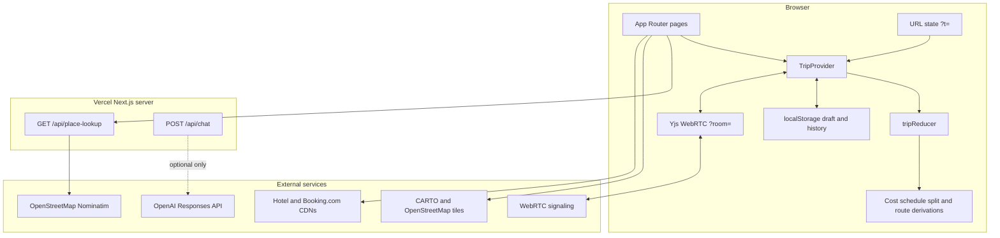
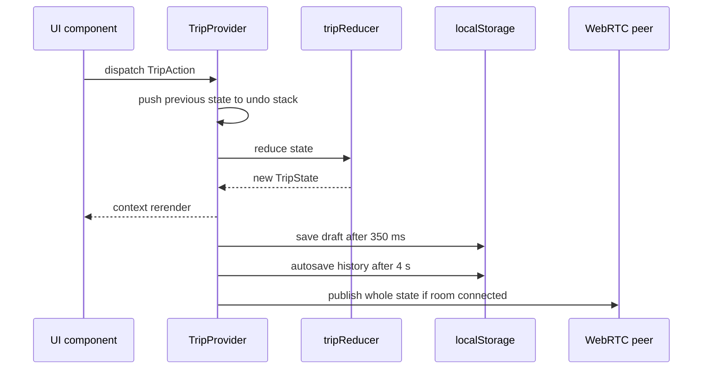
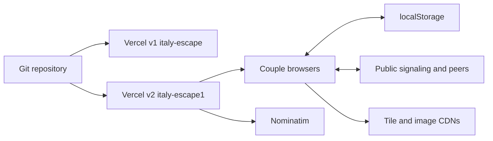

# Architecture

## Existing architecture

The application is a client-heavy Next.js App Router app. It has no application database, no authentication layer, and no durable server-side trip store. The server surface consists of two optional API routes.



## Repository structure

```text
/workspace/
├── italy-escape/                 # application
│   ├── src/app/                  # pages, layout, error boundary, API routes
│   ├── src/components/           # feature and shared UI
│   ├── src/data/                 # seeded trip content
│   ├── src/lib/                  # state, persistence, derivations, tests
│   ├── public/images/            # nine local editorial destination WebPs
│   ├── scripts/screenshots.mjs   # Playwright screenshot/console QA
│   ├── package.json
│   ├── next.config.ts
│   └── README.md
├── docs/ai/                      # canonical context created by this handoff
└── 2013-* folders                # unrelated legacy repository content
```

## Application shell and routes

`italy-escape/src/app/layout.tsx` wraps every route with:

1. `ThemeProvider` (`next-themes`)
2. `TripProvider` (canonical state/persistence/collaboration)
3. `Nav` (routes, save/history, undo/redo, theme)
4. route content
5. global `ChatPanel`

### Pages

| Route | Actual responsibility | Primary implementation |
|---|---|---|
| `/` | Overview, target, leg order, chapter summary, route map/editor, sharing | `src/app/page.tsx` |
| `/itinerary` | Simple/timeline/calendar day planning | `components/itinerary/ItineraryPlanner.tsx` |
| `/hotels` | Night assignments, real galleries, rates/links, custom hotel add | `components/hotels/HotelStoryPlanner.tsx` |
| `/explore` | Curated regional food/sight/calm/swim suggestions | `components/explore/ExploreGuide.tsx` |
| `/boats` | Private operator choices and charter details | `components/boats/BoatPlanner.tsx` |
| `/map` | Hotel/boat/transport layers and synced side list | `components/map/TripMapClient.tsx` |
| `/costs` | Categories, flights, taxes, scenarios, target | `components/costs/CostCalculator.tsx` |
| `/value` | Per-region luxury/value scenarios | `components/hotels/ValuePlanner.tsx` |
| `/print` | A4 print/PDF view | `src/app/print/page.tsx` |
| `/present` | Full-screen spouse presentation | `src/app/present/page.tsx` |
| `GET /api/place-lookup` | Nominatim proxy | `src/app/api/place-lookup/route.ts` |
| `POST /api/chat` | Optional OpenAI action generation | `src/app/api/chat/route.ts` |

`/value` is a live route but is absent from `Nav.tsx`.

## Frontend state architecture

### Canonical model

`src/lib/types.ts` defines:

- `TripState` schema version `1`
- `Destination`, `RouteLeg`, `Stay`, `HotelOption`, `ItineraryDay`, `Activity`
- `BoatExcursion` and selectable `BoatOption`
- `CostCategory`, `TripVersion`
- the full `TripAction` discriminated union

`src/data/index.ts` assembles the seed state from:

- `places.ts`
- `hotels.ts`
- `itinerary.ts`
- `boatTrips.ts`
- `transfers.ts`
- `costs.ts`

### Mutation flow



`TripProvider.tsx` owns:

- `useReducer(tripReducer)`
- undo and redo stacks (50 states)
- hydration from URL/local draft
- draft and history persistence
- author and saved-signature tracking
- collaboration session
- version save/restore
- keyboard undo/redo

### Pure derivations

| Module | Responsibility |
|---|---|
| `costCalculator.ts` | hotel/boat/tax/transport totals, scenarios, target levers |
| `schedule.ts` | dates, offsets, day reorder |
| `splitStay.ts` | signature versus boat-base night recommendations |
| `legOrder.ts` | segment days, move stays, rebuild route legs |
| `versions.ts` | structural diff summaries |

## Hydration and migration

Hydration precedence in `TripProvider.tsx`:

1. valid `?t=` URL state
2. `italy-escape:draft:v1`
3. `freshInitialTripState()`

State then passes through `normalizeTripState()` in `src/lib/migrate.ts` to fill fields added after v1. API failures/corrupt drafts are intended to fall back safely; `src/app/error.tsx` provides a clear-draft recovery screen.

**Known defect:** empty `destinations` normalize to an empty array rather than defaults. See `KNOWN_ISSUES.md`.

## Persistence

All normal trip persistence is browser-local:

| Key | Data |
|---|---|
| `italy-escape:draft:v1` | latest complete `TripState` |
| `italy-escape:history:v2` | autosaves and pinned versions |
| `italy-escape:versions:v1` | legacy versions, read and merged |
| `italy-escape:author` | local author display name |

History behavior:

- autosaves settle after four seconds
- unpinned autosaves expire after five days
- maximum 200 entries, with quota fallback to 40 recent entries
- pinned versions remain
- versions merge by ID during P2P collaboration

`?t=` contains compressed JSON for the entire `TripState`. It is currently about 32 KB for the seed.

## Collaboration and authorization

There is no authentication or authorization.

`src/lib/collab.ts`:

- creates a Yjs `Doc`
- stores stringified `state` and `versions` in a Yjs `Map`
- uses `WebrtcProvider("italy-escape-" + room)`
- publishes peer count via awareness

This uses Yjs as transport, not field-level CRDT state. Remote `state` replaces local state. Anyone with the room URL is authorized by possession.

## Hotel lookup

`AddHotel.tsx` calls `GET /api/place-lookup?q=...`.

The API:

- tries raw query, `query + ", Italy"`, then first three words
- asks Nominatim for address details/extratags
- returns name, address, lat/lng, category, website, phone, and stars
- uses a 24-hour Next fetch revalidation hint

The UI currently persists name/rate/address/website/phone-derived note, but **does not persist lat/lng into `Destination`**. The “proper pin” comment/README claim is therefore inaccurate.

## Maps

There are two active map implementations:

- `MapClient.tsx` on overview: curved/straight route lines, draggable destinations, editable destination panel.
- `TripMapClient.tsx` on `/map`: toggleable transport/hotel/boat layers and side list.

Both use CARTO tiles and Leaflet. `RouteMap.tsx` defers loading Leaflet until near the viewport.

Known divergence:

- boat origins are hard-coded (`cala-di-volpe` or `amalfi`)
- custom hotel coordinates are not added
- seed route legs and `rebuildRouteLegs()` output differ

## Backend/API architecture

There is no application backend beyond Next.js route handlers.

### `GET /api/place-lookup`

- external dependency: `nominatim.openstreetmap.org`
- no auth/rate limiting/query-length cap
- up to three sequential upstream requests per invocation

### `POST /api/chat`

- returns 503 without `OPENAI_API_KEY`
- with a key, forwards message plus complete trip state to `api.openai.com/v1/responses`
- expects JSON `{reply, actions}`
- not called by `ChatPanel`
- no auth, rate limit, or body-size cap

## Deployment



- Vercel Root Directory: `italy-escape`
- v1 URL: `italy-escape.vercel.app`
- v2 URL: `italy-escape1.vercel.app`
- no `vercel.json`; framework defaults
- `.vercel/` and `.env*` ignored

## Observability and logging

- No structured logging, analytics, error tracking, tracing, or metrics.
- `error.tsx` writes errors to browser console.
- screenshot QA captures browser console and page errors.
- API route failures return generic JSON but are not logged/monitored.

## Testing architecture

- Vitest + jsdom
- 9 test files / 47 tests
- tests focus on pure library logic
- screenshot Playwright script covers 7 desktop routes plus mobile overview and fails on console/page errors
- no React component tests despite Testing Library dependencies
- no route-handler tests
- no collaboration tests
- no formal E2E test suite or CI workflow
- no coverage reporting

## Security boundaries

1. **Browser trust boundary:** URL/localStorage/peer state is untrusted and should be fully validated before render.
2. **Bearer-link boundary:** `?t=` and `?room=` expose trip data to anyone who receives them.
3. **Server route boundary:** place lookup and optional OpenAI routes are public and currently unthrottled.
4. **External content boundary:** remote image and outbound review/operator links depend on third parties.
5. **Secret boundary:** `.env.local` and `OPENAI_API_KEY` must never be committed or copied into docs.

## Legacy, superseded, and abandoned architecture

- `HotelComparator.tsx` is superseded by `HotelStoryPlanner.tsx` and unreferenced.
- `saveVersions()` and `VERSIONS_KEY` represent legacy history behavior; legacy reads remain for migration.
- `POST /api/chat` is a dormant optional path; shipped chat is local.
- `/value` remains built but is not in navigation after later UX simplification.
- Earlier plan artifacts named many smaller components that were consolidated into current large feature components.

## Known architectural debt

1. Large monolithic client components (`ItineraryPlanner`, `TripMapClient`, `HotelStoryPlanner`).
2. Full-state cloning for undo/history/collab and large URL payloads.
3. Shallow Zod validation for nested shared state.
4. Whole-state P2P replacement instead of mergeable domain operations.
5. Duplicated Leaflet styles/logic across two map clients.
6. Seed route representation diverges from derived route rebuilding.
7. Third-party remote imagery and link availability.
8. Dormant/unused code and dependencies.
