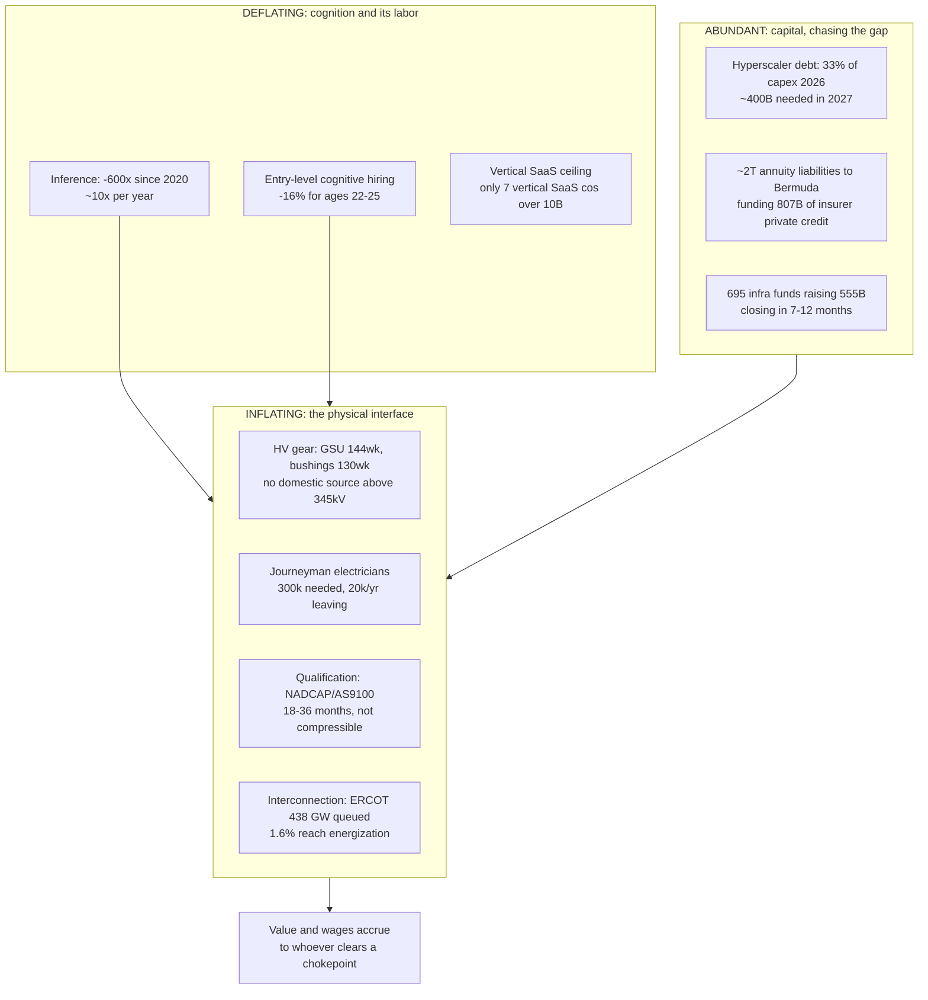
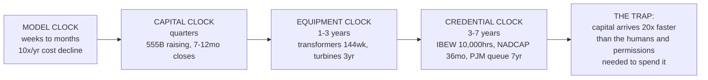

# Steel, Silicon & Salaries
### A 10-minute synthesis of ~90 links, aimed at one question: how do we provide employment using AI?

Date: 28 Jul 2026. Everything below is sourced; `†` marks claims I could not independently verify.

---

## 0. If you read nothing else

**The thesis in one sentence:** AI is collapsing the price of cognition and simultaneously inflating the price of everything cognition must touch to become real — megawatts, transformers, qualified suppliers, hands, and signatures. The employment opportunity is not "retrain people to use AI." It is to **own the interface between abundant intelligence and rate-limited physical reality**, because that interface is staffed by people and its supply is legally, not technologically, constrained.

**Five things that are true right now:**

1. **Cognition is deflating ~10x/year.** GPT-4-class inference went ~$30/M tokens (Mar 2023) → **~$0.40/M (May 2026)**; 600x since 2020. Software and architecture explain ~104% of the productivity gain — GPU cost contributes **−0.9%**. Meanwhile 22–25 year-olds in the most AI-exposed occupations show a **16% relative employment decline**, now deepening and extending to age 34 (Stanford Digital Economy Lab, dashboard updated Jul 22 2026).
2. **Physical execution is inflating just as fast.** GSU transformers **144 weeks**; Tier-1 transformer OEMs booked to **2030–31**; **no domestic source for HV bushings above 345 kV at any lead time** (DOE, May 2026); harmonic-drive reducers **14 months** on catalog product; Eaton's data-center backlog is **228 GW ≈ 12 years** of build.
3. **The binding constraint is a credential clock, not capital.** IBEW journeyman = **5 years / 10,000 hours**, legally. ~**20,000 US electricians leave annually**, ~**300,000 needed this decade**, and single hyperscale projects need **2–4x an entire local's membership**. A 60 MW delay costs **$14.2M/month**. No wage can fix this inside the decision window.
4. **AI has already created a real, large, well-paid labor market — in encoding expertise.** ~**1.4M+ people** earn from AI training-data supply (Surge ~1M annotators; Scale ~300K; Mercor 300K pool / 100K hired / **30K weekly active**; AfterQuery ~100K; Turing 4M marketplace). Mercor pays out **>$2M/day** at **$85–95/hr average**. Aggregate ≈ **$4.5B annualized gross, ~60–70% passed through to workers ≈ $2.7–3.2B/yr of new labor income.**
5. **But that market is engineered to self-liquidate.** AfterQuery got a **4.33x** benchmark gain from **1,057 expert rollouts** and **<20 minutes** of LoRA training. Vendors explicitly sell expert data as a *one-time fixed cost*. Figure hires "Humanoid Robot Pilots" at **$32/hr on 6-month fixed terms**; Genesis needs **<1 hour / <200 episodes** of robot data per new skill. Per-domain demand collapses; only *catalog breadth* sustains it.

**The conclusion those five facts force:** durable AI-created employment lives where the human is the interface to something that cannot be digitized — **hands where robots still fail, and signatures the law still requires.** And the highest-leverage move is not to compete in those markets but to **write the credential for the occupations that don't have one yet.**

---

## 1. The structural picture

Menlo's vertical-AI piece and General Catalyst's roll-up strategy are the *same trade* reached from opposite directions: stop selling software, own the services P&L, because **US healthcare spends $740B/yr on administrative services vs $63B on IT (12:1)**. Izdebska's correction is the useful part: below **30% automatable** you can't underwrite it; **30–70%** is the roll-up zone (you need the people *and* the AI); above **70%** don't buy headcount you'll delete. Everything in the physical stack sits in the 30–70% band — which is precisely why it stays employment-positive.

---

## 2. The Three Clocks — the master frame

Every constraint in your link set has a clock, and the clocks are wildly mismatched. **All the trapped money sits between the capital clock and the credential clock.**

There are exactly three ways to release the trap, and only one of them is a people business:

- **Relocate the work to a shorter-credential venue.** Prefab moves **15 weeks of on-site assembly into 2–3 weeks of factory work**; a factory electrical assembly-and-test credential is **4–8 weeks** versus 10,000 hours in the field. This is why Schneider is spending **$700M** on US prefab and GE Vernova added **~1,800 US production workers** in 2025–26. Modular costs **5–10% more per MW** — nobody buys it for price; **it is a labor-arbitrage instrument wearing a cost-savings costume** (FlexNode's CEO says retrofit economics are "horrid" for exactly this reason).
- **Import the permission.** HRV Global Life Sciences runs a **₹700 cr** API business with **zero factories** — it owns **50+ US DMFs** and orchestrates 50 partner plants running at **50–70% utilization**. The scarce asset was never the reactor; it was the filing. Azad Engineering trades at **92–110x earnings on ₹603 cr revenue** while Zetwerk trades near **1x sales on ₹15,900 cr**. The market pays ~100x for a qualification and ~1x for throughput.
- **Compress the credential.** This is the actual "employment using AI" business — and it has one hard design constraint (§4).

---

## 3. The employment ledger: where AI has actually created jobs

**Verified job creation, with numbers:**

- **Expertise encoding — ~1.4M people, ~$3B/yr of wages.** Mercor: **$2.0B gross annualized** (Jun 2026, doubled in 4 months), ~35% take rate, **>$2M/day paid out**, avg **$85–95/hr**, 400 FTE. Surge: **~$1.2B revenue with 110–130 employees** coordinating ~1M annotators. AfterQuery: **>$100M run-rate in 14 months**, ~100K professionals, $10/task to $250/hr. Handshake AI: **~$300M paid to ~100,000 fellows**, avg **$62/hr**. Structural cause worth noting: Meta buying 49% of Scale destroyed Scale's neutrality and **reallocated ~$1B of revenue by conflict of interest, not product**.
- **Physical AI operations — small per robot, enormous in aggregate demand.** Figure "Helix Data Creator" **$30/hr**; 1X data-collection operator **$28–51/hr**; Aerotek robot data collector **$28–33/hr, no experience required**. Teleop ladder: L1–L2 **$18–24/hr** → L4 precision assembly **$32–45/hr** → domain specialists **$65–120/hr with no four-year degree**. Hidden cost nobody puts in a deck: **$9,000–15,000 of teleop labor per robot per year**.
- **The unfilled-demand number that matters most.** TechForce 2026: **241,842 annual technician openings vs 101,743 graduates — a 58% gap**, costing **$7.42B/yr**. Industrial machinery mechanics: **47,962 openings vs 8,061 completions — supply covers 15% of demand; for every graduate the economy needs seven.** Electrical is **45–70% of data center construction cost**; IBEW Local 26 grew from ~10,000 to **14,700+ members** and still faces a 5.9 GW pipeline; journeyman package **$80.85/hr**, foremen approaching **$200k**.

**The honest counter-case — do not skip this:**

- **Ratios improve ~100x.** Teleop goes **1:1–1:5 (data collection) → 1:43 (Waymo, ~70 agents / ~3,000 vehicles) → 1:50–1:200+ (mature remote assist)**. A million-robot fleet at 1:200 is 5,000 jobs.
- **It offshores.** Waymo's fleet-response agents are in **the Philippines**, which is now *state-subsidizing* "AI Pilot" and "Robot Wrangler" certification via TESDA. This is BPO's second act.
- **Science employment is flat, not growing.** BLS: biological technicians **+3% to 2034**, clinical lab techs **+2%**, with automation explicitly named as a dampener. Periodic Labs pays **$100–140K** for a technician against a **$52K** national median — the wage repriced, the headcount didn't. Lilly abandoned a **~$90M** cloud lab in 2024, then signed **$1B with Nvidia** in Jan 2026.
- **Net sector accounting isn't a gain.** Manufacturing shows slight headcount reduction with **wages up 15–25%** for survivors; automated warehouse functions show **20–30% headcount reduction**.

**Synthesis:** AI reliably produces a *high-wage, credential-light, chronically understaffed* technician tier — but per-unit labor intensity is falling fast and the state-classification system can't see it. Which is the opening.

---

## 4. The sharpest insight: attack the credentials nobody owns yet

**Robotics and drone technicians do not have their own BLS SOC code.** Training CIP codes are appearing *before* federal occupational tracking exists. BLS counted ~15,000 robot technicians in 2024 against **118,000+ open US robotics technician postings**, and "Robotics Fleet" only recently became a search category on Indeed.

**The absence of a SOC code is the signal.** It means the occupation is being created faster than the state can classify it — so there is no union, no licensing board, and no incumbent credential. **Whoever writes the credential owns the labor market.**

This is exactly the play AIUC is running on the machine side: they wrote **AIUC-1** (a ~50-requirement "SOC 2 for AI agents" built on NIST AI RMF / EU AI Act / MITRE ATLAS with Orrick), sell the audit, and price **insurance up to $50M** off the audit result — with **~100 Fortune 1000 security leaders in a room every six weeks** shaping the standard. They issued the world's first AI-agent liability policy to ElevenLabs in Feb 2026. That is standards capture, not an insurance business.

**The human-side equivalent is unbuilt.** And the design constraint is non-negotiable:

> You cannot AI your way past a statutory 10,000 hours. So attack only the credentials that are **employer-defined or standards-body-defined**, never the ones that are **statutory**.

- **Attackable (no incumbent gatekeeper):** liquid-cooling / CDU-manifold technician *(category created 2022–2026; effectively zero incumbent workforce)*, commissioning agent, BAS/controls technician, factory electrical assembly & test, robot field technician, fleet teleoperator + QA reviewer, lab-automation technician, CMMC/DFARS compliance analyst, NADCAP documentation and FAI-package engineer.
- **Not attackable:** journeyman electrician, PE, RN, A&P mechanic. Sell *into* these, never around them.

The three assets that compound: (1) **the standard** — employers accept it because you wrote it with them; (2) **AI-based simulated assessment** — Genesis replaced **2,700 human-robot hours** of evaluation with sim, and RoboArena/AutoEval/RobotArena∞ show evaluation is the fastest-growing area in the field, so competence can be *measured* cheaply for the first time; (3) **indemnity** — what an employer actually buys is not a certificate, it's someone else carrying the risk of a bad tech on a $50M room. Certificate + insurance + placement is a three-legged toll on a labor market with a 2–7x supply gap.

---

## 5. Four buildable companies, ranked by employment-per-dollar × defensibility

### A. The credential + indemnity layer for un-classified physical-AI occupations — *"AIUC for humans"*
Write the standard with the 20 employers who are actually short (hyperscalers, MEP contractors, robot OEMs, RaaS operators), assess by simulation, insure the placement, take a toll on the flow. Anchor wedges: **liquid-cooling/CDU technician** (no incumbent workforce at all) and **robot field technician** (no SOC code; Cardinal Robotics is an 11-person company publicly targeting **1,000+ veterans trained as robot technicians in 2026** — a 90x headcount multiplier, and it's service headcount).
*Why it wins:* highest jobs per dollar of capital in the entire list; the moat is the standard plus verified human-performance data (the labor-side analogue of Menlo's "generative moat"); it is unattackable by a model release.
*Kill criterion:* if the top 5 employers won't co-author the standard in writing within 90 days, there is no business — you'd just be a bootcamp.

### B. The prefab electrical works — a factory that converts a 5-year credential into a 6-week one
E-houses, MV skids, pre-assembled server-room modules, harness and switchgear assembly, aimed at the **sub-20 MW mid-market** the majors deprioritize. Demand is verified and credit-worthy: Eaton **228 GW** backlog, GE Vernova electrification data-center orders **>$5B YTD 2026** (more than doubled), Schneider backlog **€25.4B (+18%)** with 18–24 months of visibility. Prefab compresses on-site MEP schedule **~18 months → 9–11**.
*Why it wins:* every job is local, non-offshorable, and trainable in weeks — this is where "provide employment using AI" is literally achievable at thousands of headcount. AI's role is the design-to-manufacture loop (configurator → BOM → harness routing → automated test), not the marketing.
*Kill criterion:* UL/IEC listing and OEM qualification timelines; and mid-market customers who fail the 15-year-lease credit test can't fund you — so pair the product with USD.AI-style financing (they've done **$13B across 200+ neoclouds in 8 months**, netting **400–600bps** over IG equivalents, with **20–30% cash down**).

### C. The qualification arbitrage — a "virtual manufacturer" of chokepoint components
Own the *permissions* and the AI engineering/QA layer; orchestrate idle qualified capacity (India, Mexico, Eastern Europe). Ranked targets by shortage × moat: **(1) HV bushings 345 kV+** — the strongest stated absence of supply anywhere in this corpus, no domestic source at any price; **(2) single-crystal turbine blade repair/reclamation** — 60–90 week cycles, <60% yields, five nations capable, and every blade restored is a blade nobody waits 90 weeks for; **(3) harmonic drives / planetary roller screws** — 14-month catalog lead times, actuators are 40–60% of humanoid hardware cost, McKinsey names roller screws the most acute risk (note: public comps at 87–118x — *manufacture it, don't buy the stock*); **(4) GaN-on-SiC RF + high-speed DACs** — <6 merchant QML foundries, and defense pricing is forecast flat-to-up while commercial falls 8–12%/yr, a rare inverted curve; **(5) microreactor precision** — Antares brought nuclear-grade graphite machining and sodium heat pipes **in-house** because no qualified merchant supply exists, which is the clearest "someone should sell this" signal in the set.
*Two forcing functions to exploit:* the **Critical Materials EO** stops DoD rubber-stamping China-sourcing waivers from **1 Jan 2027** with DOJ fraud referrals — motivated primes, not subsidies, are what finance new supply. And **CMMC Phase 2 becomes a pass/fail diligence gate on 10 Nov 2026**, which will strand every uncertified sub-$5M-EBITDA defense shop into a forced-seller cohort within one quarter.
*Kill criterion:* 18–36 month qualification is sequential and not compressible with capital. Enter via **repair/reclamation** (uses existing approvals) or via an already-qualified Indian asset — Carlyle just paid **~11.75x EBITDA for control of Micropack at 40% margins**, so the assets are priced but not yet bid up.

### D. The flexibility wrapper — highest financial return, lowest employment
Curtailing **0.25–1.0% of uptime unlocks 76–126 GW** and avoids **$40–150B** of capex (Duke Nicholas Institute), but pays a data center only **$2.50–8.00/MWh** — far too little to change siting. So flexibility will be **confiscated, not purchased**: NERC issued a rare **Level 3 alert in May 2026** after **>1,000 MW of data-center load dropped in seconds**, and FERC ordered NERC to write mandatory reliability standards for computational *loads* by Dec 31 — the first time large loads carry obligations. A&M's money line: **four merchant streams plus one contracted stream finances like one contracted stream**, because lenders size to the contracted floor. Whoever first assembles standardized M&V + an investment-grade counterparty + a bounded tail creates the asset class and takes the spread. **This is the clearest unbuilt business in the whole stack — but it employs dozens, not thousands.** Run it as the capital engine, not the mission.

---

## 6. Link decoder — what each cluster actually means

**Vertical AI / services.** Menlo: ROI moves from IT budgets to people budgets; moats are *defensive* (regulation, human sign-off) plus *generative* (compounding data); the "Clone Test" — if a clone with your codebase and frontier models today wouldn't lose, you have no moat. GC has deployed **>$750M across ≥10 platforms**, mapped **70 service categories → 10**, and is targeting 5–10% EBITDA services → 30–40%; Long Lake did **30+ acquisitions in ~17 months** and is taking **Amex GBT private at $6.3B / 11.8x EBITDA**. Nothing has closed and nothing has been through a cycle. Turgon (SF + New Delhi, ~18 people) is the agent-native systems integrator attacking $1.5T of IT services. Capable.com is *not* a services company — it's AI-bio, running design→mouse in **24 hours vs 4+ weeks**. 1001.ai raised **$39M in 8 months** for sovereign industrial AI in the Gulf.

**Physical AI.** `awesome-physical-ai` shows the field's bottleneck moved to **evaluation** (RoboArena, AutoEval, WorldGym) — one ICLR 2026 submission finds **no correlation** between a VLM's benchmark score and its downstream VLA performance. Genesis AI is the most important item: **GENE-26.5** hits human-level manipulation with **<1 hour / <200 episodes per skill**, off **200,000+ hours** of collected data, and their line is the whole thesis — *"over 80% of physical labor is manipulation. Almost none of it has ever been recorded"* against a **~$40T** physical-labor market. Their glove is deliberately minimally invasive so **real work becomes data collection** — which makes an incumbent skilled worker an appreciating asset, not a cost. Standard Bots ($200M Series C at $1B, RO1 at **~$37K**, taught by demonstration) disintermediates the **system integrator**, historically 1–3x the robot's price, and relocates programming authority to the line worker. Megan Liu's **Autonomy Burden Score** (intervention minutes/shift, mean time between assists) is the sleeper concept: once residual human labor is a dashboard metric, it becomes a budgeted line item — instrumentation institutionalizes the job. McKinsey: **~$370B general-purpose robotics by 2040** from **<$1B today**, ~50% of value in China, and the diagnosis is **"pilot purgatory"** — hardware ready, organizations not. Every dollar spent on organizational readiness buys humans.

**Energy & data centers.** Sean James (25 yrs Microsoft, now Nvidia): a data center is a factory converting electricity into tokens; the protective design that makes each site reliable makes the *system* unstable. Goldman: **31 GW (2025) → 66 GW (2027)** of US data-center power, **~$7.6T of capex 2026–31**, and capex estimates are **outrunning actual construction**. ERCOT's large-load queue is **>438,000 MW (~90% data centers)** against an all-time system peak of 85,508 MW, with only **~9.0 GW approved to energize** — a **~1.6% funnel**. GE Vernova has **116 GW** of gas turbines under contract and only **~10 GW of slots left across 2029–30**, but their own CEO says **the turbine is not the gating item** — permits and EPC are. Colo vacancy **1.2%**, **81.5% of under-construction capacity pre-leased**; the mid-market gap is a **credit filter**, not a capacity shortage.

**Capital stack.** The mechanism worth memorizing: retiree annuity → life insurer cedes the block to Bermuda/captive (reserve relief) → freed capital into private credit → 144A paper → SPV building a pre-leased data center. **~$2T** of US life liabilities sit in these structures; insurers hold **~$807B** of private credit; data-center securitization went **$4B (2020) → $61B YTD 2026**. On Meta's **$27B** Hyperion/Beignet financing the P&C market **could not write full replacement cost**, so S&P used Probable Maximum Loss and **Meta backstopped the gap with its own balance sheet** — the "bankruptcy-remote" ring fence has a door back to the sponsor, and it's an insurance door. Three live cracks: hyperscaler bond coverage ratios fell from **~5x in February to under 2x by mid-July 2026**; banks spent **6+ months trying to offload $38B of Oracle-linked construction debt, some at a discount**; and Nvidia backstops **$6.3B of unsold CoreWeave capacity through 2032**, making the supplier the customer of last resort for its own chips. The regulatory clamp is already moving (AG 55 cash-flow testing, first reports Apr 1 2026; NAIC power to challenge ratings). **The binding constraint on 2028 AI capex may be an actuarial capital charge, not a megawatt.**

**Industrials & defense.** Jess Leão's relaunch is the anchor: AI's fate is decided in capacity auctions and county board meetings. **PJM's 2028–29 auction cleared at the FERC cap ($325/MW-day, $16.4B) and was still 6,831 MW short with only ~525 MW of new supply bidding**; **New York banned new ≥50 MW data centers**. That makes **bring-your-own-generation the default** for every fab, defense factory and training cluster — which is the demand curve under Antares (**$470M Series C**, Mark-0 critical at INL Jun 2026, first US non-light-water criticality in 40+ years, **EO 14299 mandates a reactor on a military installation by 30 Sep 2028**). TransDigm vs Rocket Lab vs AMCA are three moat archetypes: own the *part number* (**52.6% EBITDA margin**, 5–6% annual aftermarket price increases, sub-$3M-revenue parts too small to attack), own the *stack* (38% GM, backlog as the asset), own the *program position* (AMCA's winner must incorporate a new Indian company — 40 years of spares and MRO handed to a greenfield entity). Caterpillar's backlog is **$62.7B, +79% YoY** with power-gen retail **+48%**, and the mix shift from standby diesel to *prime power* is quietly converting a cyclical equipment book into a TransDigm-shaped annuity. Memory's tell: in Q1 2026 **64GB DDR5 RDIMM per-wafer value overtook HBM** and HBM margins fell below high-end server DDR5 for the first time — **scarcity migrates to whatever nobody added capacity to**, which is also why 65/40nm data converters went 26 → 40+ weeks while everyone watched 2nm.

**AI for science.** Self-driving labs change *what chemists do*, not how many: agents propose and dispatch, humans prefill reagents, pick candidates, troubleshoot — and **no facility can yet operate without human intervention**. Robots fail at >3 synthetic steps and cannot weigh sticky or hygroscopic solids. Atinary produces **~one PhD's worth of data per week**; Radical AI goes 70 alloys/week → 100/day; robot arm prices fell **~$50,000 → under $2,000**. The real economics: a scraped token is free, a measured datapoint costs dollars to hundreds of dollars — **6 orders of magnitude** — and the scarce asset is **negative results**, because literature is survivorship-biased and "we don't publish things that don't work… then they don't know where *not* to go." Two opposing strategies are funded at the same prices: **own the labs** (Periodic **~$500M at $7.5B pre**†, Lila **~$2B at $8.5B**†) vs **rent them** (CuspAI **$450M at $2.6B**, 45+ partners' fabs and instruments). They can't both be right about where the moat sits. And Insilico is the proof-of-concept that matters: **H1 2026 revenue $102.5–106.5M (+~280%), profitable**, with rentosertib in **Phase III as of 7 Jul 2026**.

---

## 7. Nine corrections — things in your list that are wrong

These matter because several would send you down a wrong path:

1. **"Radix Arc — inference team from xAI"** → it's **RadixArk**, the **SGLang** spinout: Ying Sheng (one ex-xAI engineer, not a team lift-out) + Banghua Zhu, **$100M seed at $400M, Accel + Spark**. The interesting fact is that **Nvidia's NVentures, AMD, and MediaTek all funded the same serving engine** — merchant silicon paying to commoditize CUDA.
2. **The five X links are not the Goldman Sachs report.** They're all Jul 7–8, 2026 and they're about Everett Randle's **"The Task Economy: Data Will Be the Next $1 Trillion Category"** (labs scaling data spend **10x YoY**; app companies with **>$100M individual task budgets**), Jeff Richards endorsing it, Deidre Bosa on **"the customers are now benchmarking the labs"** (DoorDash's multi-model reviewer caught **53.6% of real PR issues at $3.91/PR**, released DashBench internally), John McElhone launching **American Turbines** (~1 MW gas turbines, **<40 parts**, fit in a pickup truck — *the factory is the product*), and Mignano at USV on **edge data**.
3. **Dario Amodei never said "100M-token context support."** In the Dwarkesh interview (13 Feb 2026) *Dwarkesh* said it; Amodei's answer was **"This isn't a research problem. This is an engineering and inference problem… you have to store your entire KV cache."** The implication is the important part: **long context is the one product direction that makes inference gross margins worse**, because KV cache bids against HBM that is **sold out through 2026** at high-teens-to-low-20% price increases.
4. **"Sail Research"** is not AI-for-science. It's an inference company for long-horizon agents (**$80M at $450M**, Kleiner-led, Neil Movva ex-Nvidia), claiming **up to 10x lower cost per token**. Your pairing with Genesis suggests you meant "physical/embodied AI infrastructure."
5. **arXiv 2607.16097 is not physical AI.** It's *"Understanding Reasoning from Pretraining to Post-Training"* — chess as a controlled testbed for the pretrain→RL interface. Useful (pretraining loss predicts post-RL pass@1 at ρ = −0.93 to −0.99; optimal RL compute fraction rises with budget; **pass@16 flat or degrading under RL**), but not robotics. Same for **LHTB** = Long-Horizon Terminal-Bench, whose most transferable finding is that **79% of unresolved runs time out while still making progress** — horizon exhaustion, not incapability, which is the structural argument for permanent human escalation.
6. **"Josh Elman"** joined **a16z** in June 2026 (from Apple/Siri), not Menlo or Reset, and his verified July 2026 output is consumer AI and OpenClaw — **not** employment. The specific tweet is unfetchable; treat its content as unknown.
7. **"Ab Initio Bio"** — the only match, Ab Initio Biotherapeutics, was **acquired by Ligand for $12M in 2019** and wasn't AI-native. If you meant a 2026 company, the nearest analogues are **Boltz** ($28M seed, Pfizer + Takeda pipelines) and **EvolutionaryScale**.
8. **"Fractal power / SF compute"** are two unrelated companies: **SF Compute** is an order-book spot market (H100 **$2.13–2.20/GPU-hr**, resale with floors, manages **>$100M of hardware it doesn't own**); **Fractal Power** (Austin, $9.85M Series A Jan 2026) owns and *trades* distributed generation at grid-imbalance nodes. Same idea in two commodities: own small assets, monetize the spread. CME and ICE are both moving toward compute contracts.
9. **Smaller ones:** FlexNode's investors are **Eaton, Zacua, DivcoWest, Colle, ARPA-E** — no Punch Capital. **Opna.earth pivoted** from carbon finance to **market infrastructure for HV power equipment** (0% upfront, reservable slots against 4+ year OEM lead times) — a perfect illustration that every AI thesis terminates at a transformer queue. **"HRV factory India"** is HRV Pharma, which has *no* factories. **Cognite** was acquired by **Schneider Electric for $3.1B (30 Jun 2026)** — ~18x revenue for industrial DataOps, i.e. the electrical-equipment giant just bought the industrial data layer. And **Standard Compute's "5–7x cheaper"** is a billing arbitrage, not a serving innovation: their own calculator compares $39/mo against Claude Opus at $630/mo while routing to DeepSeek V4 Flash (~$6/mo for the same workload). Flat-rate unlimited inference is **structurally short gamma**.

---

## 8. What needs to be true (and the kill criteria)

**For the credential/indemnity company (A):**
- ✅ Already true: 58% technician supply gap; no SOC code for robot technicians; 118K+ open postings; **$28–33/hr entry with no experience required** and a **$65–120/hr** ceiling without a four-year degree.
- ❓ Must be true: **employers will accept a private credential in lieu of experience.** Test in 30 days by asking 20 hiring managers for a signed letter of intent on placement volume at a stated rate.
- ❓ Must be true: **an insurer will price the indemnity.** AIUC proved this is possible for agents in ~18 months from seed to first policy; the human version needs one carrier and one loss model.
- ☠️ Kill it if: the demand concentrates in 3 employers who prefer to run their own academies (Microsoft already committed 5,000 workers), or if the roles offshore before you can localize the credential — watch TESDA's Philippine "Robot Wrangler" certification as the leading indicator.

**For the prefab electrical works (B):**
- ✅ Already true: 228 GW of backlog, 144-week transformer queues, 45–70% of construction cost is electrical, and prefab is already the majors' answer.
- ❓ Must be true: you can win **UL/IEC listing plus one hyperscaler or top-5 MEP qualification** before capital runs out, and the sub-20 MW customer can be financed.
- ☠️ Kill it if: Schneider/Eaton/Vertiv price the mid-market segment as a defensive loss-leader, or if the 2028 capacity wave (every announced memory, turbine and transformer expansion lands simultaneously in **2028**) arrives before you reach scale.

**For the qualification arbitrage (C):**
- ✅ Already true: no domestic HV bushing above 345 kV at any price; Indian qualified capacity at 50–70% utilization; Critical Materials EO on 1 Jan 2027; CMMC gate on 10 Nov 2026; the market pays ~100x for a certificate and ~1x for throughput.
- ❓ Must be true: you can enter through **repair/reclamation or an already-qualified asset**, because 18–36 month qualification is sequential and capital cannot compress it.
- ☠️ Kill it if: your target has >20% customer concentration (the single biggest multiple-killer) or you're bidding against PE add-ons — the arbitrage is closing at the bottom, where add-ons average **5.7x vs 4.5x for platforms**.

**The cross-cutting risk to underwrite once:** the entire physical buildout is financed by a stack whose collateral is **contracts on ~6 counterparties' credit wearing a hard-asset costume**, with GPU depreciation schedules (**6 years at CoreWeave, 4 at Nebius, 3–4 in reality**) that guarantee a dated impairment. If financing seizes in 2027–28, options A and C survive (they sell into shortage regardless of who owns the asset); option B does not without a diversified order book outside data centers.

---

## 9. Next 10 days

1. **Pick the wedge occupation.** My vote: **liquid-cooling / CDU technician** — the category was created between 2022 and 2026, there is effectively **no incumbent workforce**, no union claim, and no licensing board. You can define the credential rather than negotiate with one. Second choice: **robot field technician** (no SOC code; Cardinal's 1,000-veteran plan is a customer, not a competitor).
2. **Get 20 signed letters of intent** on placement volume and rate. This is the whole business risk; everything else is execution.
3. **Find the carrier.** One conversation with a specialty carrier on a loss model for certified-technician placement. Copy AIUC's structure exactly: audit → standard → policy priced off the audit, risk on someone else's balance sheet.
4. **Call two people:** Cardinal Robotics (11 people trying to hire 1,000 technicians — they need you) and the Genesis AI data team (their glove thesis needs a workforce that is already inside real work).
5. **Decide the geography split now.** The India leg is the qualification arbitrage (C) and the data-capture supply; the US leg is the credential + indemnity (A) and prefab (B). Do not blend them — the moats are different: permissions in India, non-offshorable locality in the US.

---

**Read-order if you only have 3 links:** Menlo's vertical AI piece (the labor-vs-IT budget framing), Genesis AI's GENE-26.5 post (the "80% of physical labor is unrecorded" claim plus the <200-episode data numbers), and A&M / Sean James together (why flexibility gets confiscated rather than purchased).

**Skip:** arXiv 2607.16097, LHTB, get-physics-done, Standard Kernel, and the Instagram reels — none of them change a decision. Multiverse Computing (**$570M "targeting" at $1.7B on ~€13M revenue**, heavy EU state backing, "quantum-inspired" = classical tensor decomposition) is a watch-whether-it-closes, not a thesis.
